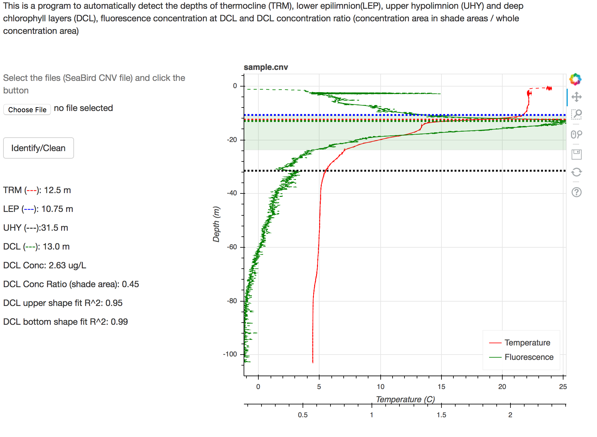

# CTD thermocline and DCL automated detector

This folder creates a tool to analyze CTD (conductivity, Temperature, and depth) profilers, specifically for SeaBird CTD profilers.

It can:
* Detect lake stratification (the location of thermocline, epilimnion, hypolimnion) using piecewise linear segmentation (HMM with maximum gradient is currently turned off to save compuation time)
* Detect deep chlorophyll layers by fitting two half gaussian curves on peak points
* A Flask Python app is available, run 

	python application.py

---
To Install:
Installl anaconda and bokeh

To use:
	
	from seabird.seabird_class import seabird
	import json
	import matplotlib.pyplot as plt
	
	config=json.load(open('config.json'))
	mySeabird = seabird(config = config)  # config is in json format
	filename = "sample.cnv"
	mySeabird.loadData(dataFile = filename)  # filename is the cnv file, taking data from database is optional, see the source code
	mySeabird.preprocessing()
	mySeabird.identify()
	features = mySeabird.features  # features are in dictionary format.

	print features
	

The output features are:

DCL features:
* allConc: the sum of Chlorophyll concentration with 0.25m sampling interval
* allConc_upper: the sum of Chlorophyll concentration above LEP, with 0.25m sampling interval
* DCL_upperDepth_fit: the upper boundary of the DCL peak. This value is always deeper than LEP since LEP is used as a threshold to cut. 
* DCL_bottomDepth_fit: the lower boundary of the DCL peak
* DCL_upperConc_fit: the concentration at DCL_upperDepth_fit
* DCL_bottomConc_fit: the concentration at DCL_bottomDepth_fit
* DCL_leftSigma: the sigma of the Gaussian shape for upper shape
* DCL_rightSigma: the sigma of the Gaussian shape for lower shape
* DCL_conc: the concentration at the maximum peak
* DCL_depth: the depth with maximum concentration for the DCL peak
* DCL_concProp_fit: the ratio of Chlorophyll in DCL, compared to the whole water column
* DCL_exists: whether DCL exist
* peakNums: how many significant peak detected

* DCL_leftShapeFitErr: the error of fitting a Gaussian shape for upper DCL part
* DCL_rightShapeFitErr: the error of fitting a Gaussian shape for lower DCL part

Lake Stratification features
* TRM_gradient_segment: the gradient of temperature at TRM (unit C/m)
* TRM_segment: the depth of thermocline using PLR method
* UHY_segment: the depth of upper hypolimnion
* LEP_segment: the depth of the lower epilimion
* doubleTRM: whether double thermocline exist
* positiveGradient: whether abnormal temperatuer increasing with depth exists
* firstSegmentGradient: the gradient of the first segment (C/m)
* lastSegmentGradient: the gradient of the last segment (C/m)

To plot:

	mySeabird.plot_all(interestVarList=["Temperature","DO","Specific_Conductivity","Fluorescence","Par"]) # plot the water quality from raw data
	mySeabird.plot() # plot the detected depth
	plt.show()

---
File structure:

 	
	--Seabird:
		--seabirdGUI.py: GUI build based on Tkinter
		--seabird_class.py: seabird class
		-- deepChlLayers.py: DCL class
		-- thermocline.py: thermocline class
		--tools: contain general file parser, database connection
		--models: Piecewise linear segmentation, HMM and threshold methods. 

